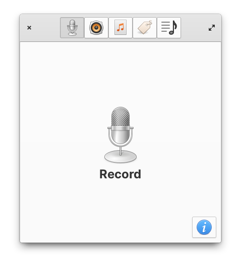
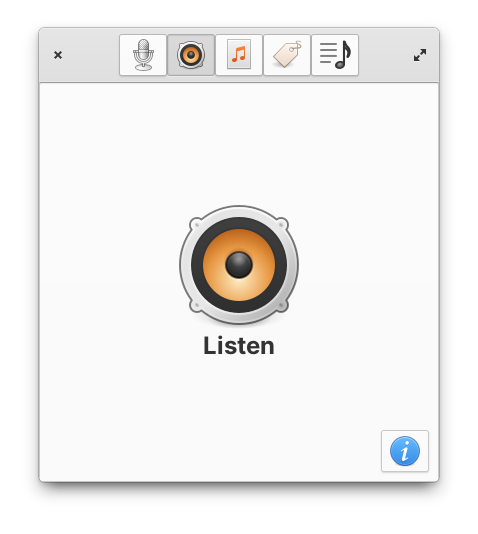
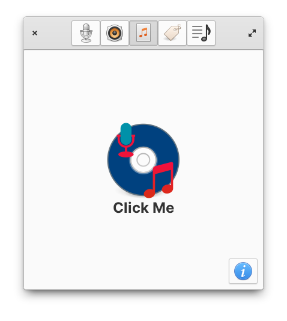
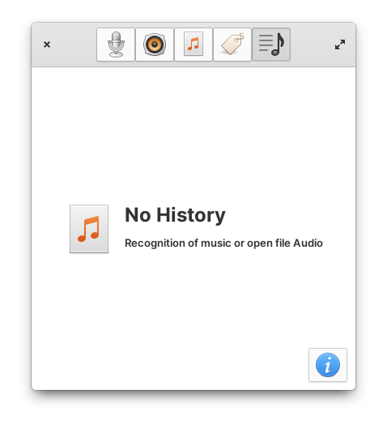
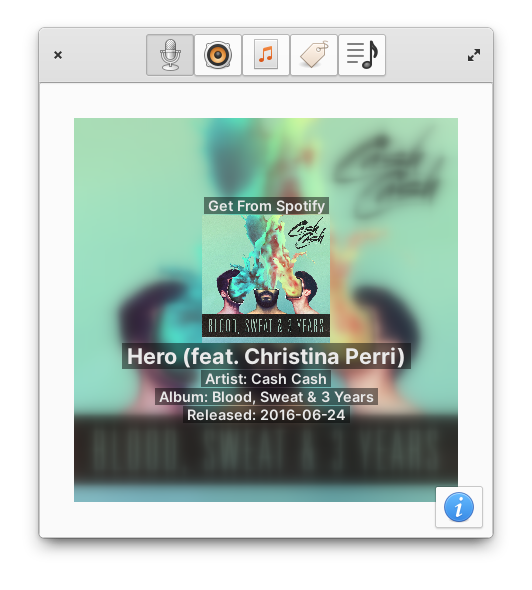
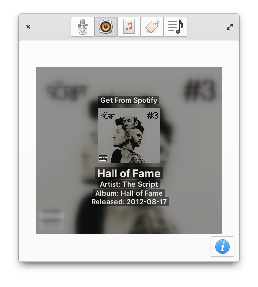
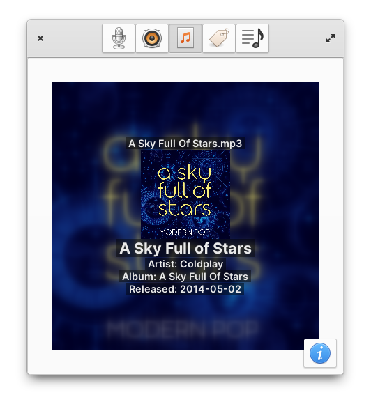

<h1 align="center"> Gabut Audio Tag </h1>
<h1 align="center">
    
</h1>
<h4 align="center">🌟 Simple Recognize Songs from your Computer 💫</h4>
<h1 align="center">🚀 Release on ✈️</h1>

    
    
    
    

<h1 align="center">🤖 Gabut Audio 🤖</h1>
<h2 align="center">🤖 GTK4 Writen in Valac 🤖</h2>

Gabut Audio is a song identification application that uses can identify songs from files and microphones and internal speakers. Audio tags can also save information into your mp3 files so you don't have to bother with manual editing of your music. just one press of the application will identify then the info will be stored in the music layer mp3 m4a and flac.

<h1 align="center">🤖 This application relies heavily on: 🤖</h1>
1. [AudD](https://dashboard.audd.io/) as an identifier songs
2. [taglib](https://github.com/taglib/taglib) as a music tagger

<h1 align="center">🤩 Input microphone of GabutAudio 🙈</h1>

    

<h1 align="center">🚅 Internal audio card of GabutAudio 🙈</h1>

    

<h1 align="center">🧩 identifier from File of GabutAudio 🙈</h1>

    

<h1 align="center">🏡 History identifier of GabutAudio 🙈</h1>

    

<h1 align="center">🤩 Result Input microphone of GabutAudio 🙈</h1>

    

<h1 align="center">🚅 Result  Internal audio card of GabutAudio 🙈</h1>

    

<h1 align="center">🧩  Result identifier from File of GabutAudio 🙈</h1>

    

